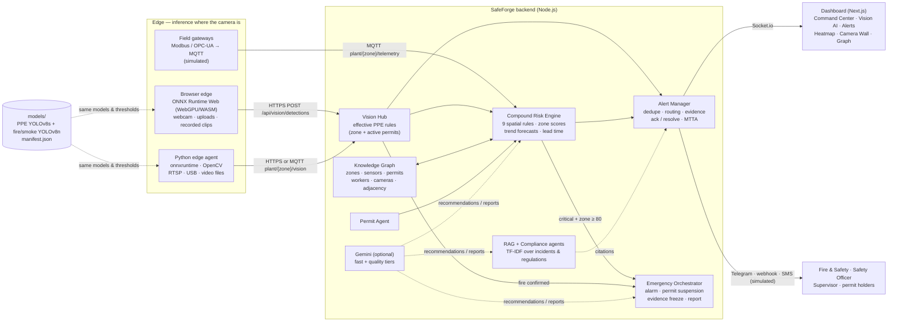

# SafeForge Nexus architecture

Edge-first and event-driven. Raw video never leaves the edge: cameras are analysed where they are, either in an operator's browser or by a Python agent next to the NVR. Only structured detections and, for confirmed events, a single evidence frame travel to the platform.

## Vision pipeline (identical on both edges)

1. **Letterbox** the frame to 640×640 (pad 114), normalise and convert to CHW.
2. Run **two YOLOv8 heads**: PPE (19 classes) and fire/smoke (2 classes).
3. **Decode and NMS** class by class, with per-class thresholds from `models/manifest.json`.
4. **Fire verification**:
   - Fire boxes mostly inside a detected `Vest` are dropped (hi-vis false positives).
   - Fire boxes with confidence between `fire_low` and `fire` must pass a flame-colour pixel ratio.
5. **PPE association**:
   - Each PPE item is assigned to the worker box that contains it.
   - A "No-Helmet" with no matching worker creates an inferred worker.
   - Every item is `ok`, `missing` or `unknown`. Only explicit `missing` on a required item is a violation, which keeps occlusion from causing false alarms.
6. **Temporal confirmation**: k-of-n frames per event type. A single image counts as its own window.
7. **Payload**: workers, hazards, events and an evidence JPEG when an event type is newly confirmed.

The backend **re-evaluates PPE** against the *effective* requirement: zone baseline plus PPE demanded by active permits. Edges therefore never need to know about permits.

## Compound risk engine

Rules are evaluated over the knowledge graph using same-zone or adjacent-zone relationships:

| Rule | Severity | Signal |
|---|---|---|
| CR-001 | Critical | Hot work + flammable gas >60 % of alarm, or rising with alarm ETA < 15 min |
| CR-002 | Critical | Confined-space entry + O₂ < 20 %, or falling below 20.5 % |
| CR-003 | High | SIMOPS: conflicting permit types in the same or adjacent zones |
| CR-004 | High | Rising gas near active permit work |
| CR-005 | High | Temperature + pressure warnings in adjacent zones |
| CR-006 | High | CCTV PPE violation during permit work |
| CR-007 | Critical | CCTV fire or smoke + permit, hazardous zone or elevated gas |
| CR-008 | Medium | Shift handover with ≥ 2 high-risk permits open |
| CR-009 | Critical | Workers inside a zone with a critical atmosphere |

**Zone score** combines four inputs:
- hazard class baseline
- sensor states and trends
- permit weights
- CCTV findings and rule hits

A critical rule floors its zone at 85, and a declared emergency keeps the zone at 90 until it is stood down. The plant score is the worst zone plus 5 per additional hot zone.

**Forecasting:** a least-squares trend runs over the last 10 readings (20 s). A trend only counts when r² > 0.6 and the movement is large relative to the sensor's baseline→warning band. That filters mean-reverting noise (0.47 % false-trend rate) while catching the kill-chain drift within 8 s.

## Alert lifecycle

`raise → dedupe (type + zone key) → enrich (location, regulations, actions, graph chains) → route (role matrix + permit holders) → deliver (dashboard / Telegram / webhook / SMS-sim) → acknowledge → resolve`

- Repeat observations refresh the open alert (occurrence count, newer evidence) instead of duplicating it.
- If severity rises, the alert escalates and is re-notified.
- When a condition stops being observed, the alert is marked *cleared* but stays open until a person resolves it.

## Production mapping

| Prototype | Production |
|---|---|
| Simulated sensors and SCADA (OU noise around dataset baselines) | Modbus/OPC-UA gateway → MQTT topics already consumed |
| In-memory knowledge graph | Same node/edge model in Neo4j |
| TF-IDF vector index | Embeddings + ChromaDB/Pinecone (same `retrieve()` contract) |
| In-memory alert store | MongoDB/Postgres with audit log |
| Browser edge for demos | Python agent per NVR / Jetson device (`cv-service`, Dockerfile included) |
